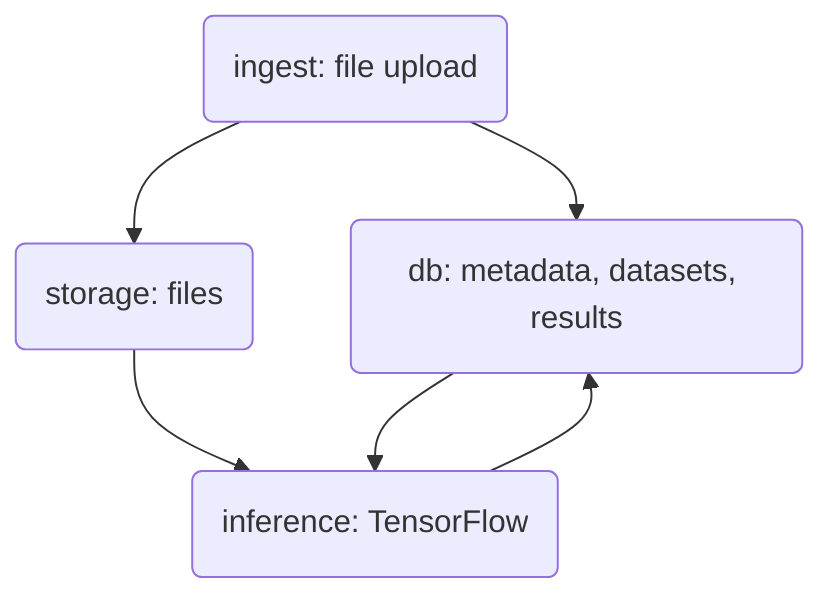

# Mitwelten ML Backend

## Pipeline Overview

## ingest

Import of assets, metadata to __db__ (PostgreSQL), files to __storage__ (minIO S3).

- extract metadata from files
- check for naming collisions with existing files
- upload _metadata to db_
- upload _files to storage_

The import of existing audio data is documented in the [import-existing-audio report](./ingest/report_import-existing-audio.md).
The accompanying code is found in [ingest/import_existing/](./ingest/import_existing/). Further development will be based on this code.

### audio uploader app

To upload audiofiles recorded by Audiomoths, you can use the [mitwelten-audio-uploader app](/ingest/uploader/).

## database

- __files__ (metadata)
- __datasets__ (collections of files)
- __paramsets__ (inference configuration)
- __results__ (inference)

For details check [initialize_db.sql](./database/initialize_db.sql).

Set credentials in `credentials.py` (`db`)

## storage

Bucket on minIO S3 backend, publicly accessible.

Set credentials in `credentials.py` (`storage`)
