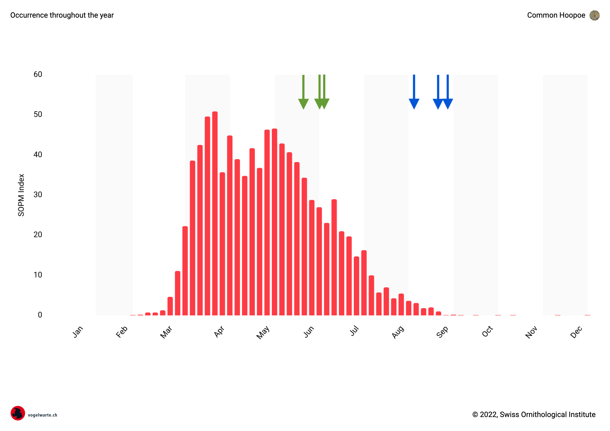

# BirdNET: Applying the week filter

Narrowing down the results by generating species-lists dependent on week
caused a reduction of hits by 10% (before: 563'509, after: 509'941 for
device id 3704-8490).

| month | count 4 | count 5 | diff   |
| ----- | ------- | ------- | ------ |
|     5 |  175518 |  158255 | 9.84%  |
|     6 |  221688 |  201795 | 8.97%  |
|     7 |  100282 |   94024 | 6.24%  |
|     8 |   59088 |   50379 | 14.74% |
|     9 |    6933 |    5488 | 20.84% |

Some of the species are completely removed species:

| Species                       | w/o filter (s_id 4) | s_id 5 | removal |
|-------------------------------|---------------------|--------|---------|
| Turdus merula                 | 1408                | 1408   | 0.00%   |
| Apus apus                     | 1156                | 1156   | 0.00%   |
| Erithacus rubecula            | 678                 | 678    | 0.00%   |
| Certhia brachydactyla         | 536                 | 536    | 0.00%   |
| Picus viridis                 | 295                 | 295    | 0.00%   |
| Fringilla coelebs             | 283                 | 283    | 0.00%   |
| Columba palumbus              | 278                 | 278    | 0.00%   |
| Corvus frugilegus             | 249                 | 249    | 0.00%   |
| Falco tinnunculus             | 190                 | 190    | 0.00%   |
| Muscicapa striata             | 176                 | 176    | 0.00%   |
| Alopochen aegyptiaca          | 175                 | 175    | 0.00%   |
| Coccothraustes coccothraustes | 175                 | 175    | 0.00%   |
| Turdus philomelos             | 140                 | 140    | 0.00%   |
| Cuculus canorus               | 117                 | 117    | 0.00%   |
| Poecile palustris             | 90                  | 90     | 0.00%   |
| Sylvia atricapilla            | 86                  | 86     | 0.00%   |
| Motacilla cinerea             | 82                  | 82     | 0.00%   |
| Ardea cinerea                 | 78                  | 78     | 0.00%   |
| Carduelis carduelis           | 74                  | 74     | 0.00%   |
| Sitta europaea                | 74                  | 74     | 0.00%   |
| Alcedo atthis                 | 63                  | 63     | 0.00%   |
| Pica pica                     | 54                  | 54     | 0.00%   |
| Parus major                   | 50                  | 50     | 0.00%   |
| Troglodytes troglodytes       | 46                  | 46     | 0.00%   |
| Strix aluco                   | 42                  |        | 100.00% |
| Dendrocopos major             | 39                  | 39     | 0.00%   |
| Aegithalos caudatus           | 35                  | 35     | 0.00%   |
| Ixobrychus minutus            | 28                  |        | 100.00% |
| Tyto alba                     | 22                  |        | 100.00% |
| Emberiza cirlus               | 22                  | 21     | 4.55%   |
| Phoenicurus ochruros          | 20                  | 20     | 0.00%   |
| Dendrocoptes medius           | 20                  | 11     | 45.00%  |
| Turdus viscivorus             | 18                  | 18     | 0.00%   |
| Passer domesticus             | 16                  | 16     | 0.00%   |
| Corvus cornix                 | 16                  | 16     | 0.00%   |
| Garrulus glandarius           | 16                  | 16     | 0.00%   |
| Tadorna tadorna               | 15                  | 15     | 0.00%   |
| Ficedula hypoleuca            | 15                  | 13     | 13.33%  |
| Buteo buteo                   | 14                  | 14     | 0.00%   |
| Merops apiaster               | 13                  | 13     | 0.00%   |
| Chloris chloris               | 13                  | 13     | 0.00%   |
| Motacilla alba                | 12                  | 12     | 0.00%   |
| Phoenicurus phoenicurus       | 11                  | 11     | 0.00%   |
| Turdus iliacus                | 11                  |        | 100.00% |
| Branta canadensis             | 10                  | 10     | 0.00%   |
| Turdus torquatus              | 10                  |        | 100.00% |
| Asio otus                     | 8                   |        | 100.00% |
| Ichthyaetus melanocephalus    | 8                   | 1      | 87.50%  |
| Scolopax rusticola            | 8                   |        | 100.00% |
| Cyanistes caeruleus           | 8                   | 8      | 0.00%   |
| Sturnus vulgaris              | 7                   | 7      | 0.00%   |
| Anser anser                   | 7                   | 7      | 0.00%   |
| Milvus milvus                 | 7                   | 7      | 0.00%   |
| Phasianus colchicus           | 6                   | 5      | 16.67%  |
| Upupa epops                   | 6                   | 3      | 50.00%  |
| Coturnix coturnix             | 6                   | 4      | 33.33%  |
| Gavia stellata                | 5                   |        | 100.00% |
| Serinus serinus               | 5                   | 5      | 0.00%   |
| Luscinia megarhynchos         | 4                   | 4      | 0.00%   |
| Regulus ignicapilla           | 4                   | 4      | 0.00%   |
| Ciconia ciconia               | 4                   | 4      | 0.00%   |
| Numenius arquata              | 3                   |        | 100.00% |
| Lullula arborea               | 3                   | 3      | 0.00%   |
| Larus michahellis             | 2                   | 2      | 0.00%   |
| Fringilla montifringilla      | 2                   |        | 100.00% |
| Tringa ochropus               | 2                   | 2      | 0.00%   |
| Phylloscopus sibilatrix       | 2                   |        | 100.00% |
| Dryocopus martius             | 2                   | 2      | 0.00%   |
| Anthus trivialis              | 2                   | 2      | 0.00%   |
| Gallinula chloropus           | 2                   | 2      | 0.00%   |
| Turdus pilaris                | 2                   |        | 100.00% |
| Anas platyrhynchos            | 2                   | 2      | 0.00%   |
| Columba oenas                 | 2                   | 2      | 0.00%   |
| Luscinia svecica              | 2                   |        | 100.00% |
| Grus grus                     | 2                   |        | 100.00% |
| Certhia familiaris            | 1                   | 1      | 0.00%   |
| Anthus campestris             | 1                   |        | 100.00% |
| Anas crecca                   | 1                   |        | 100.00% |
| Alauda arvensis               | 1                   | 1      | 0.00%   |
| Hydroprogne caspia            | 1                   |        | 100.00% |
| Loxia curvirostra             | 1                   | 1      | 0.00%   |
| Mergus merganser              | 1                   |        | 100.00% |
| Hirundo rustica               | 1                   | 1      | 0.00%   |
| Morus bassanus                | 1                   |        | 100.00% |
| Nucifraga caryocatactes       | 1                   |        | 100.00% |
| Panurus biarmicus             | 1                   |        | 100.00% |
| Fulica atra                   | 1                   | 1      | 0.00%   |
| Emberiza citrinella           | 1                   | 1      | 0.00%   |
| Emberiza calandra             | 1                   | 1      | 0.00%   |
| Phylloscopus collybita        | 1                   | 1      | 0.00%   |
| Delichon urbicum              | 1                   | 1      | 0.00%   |
| Pluvialis squatarola          | 1                   |        | 100.00% |
| Cygnus olor                   | 1                   | 1      | 0.00%   |
| Pyrrhocorax pyrrhocorax       | 1                   |        | 100.00% |
| Rallus aquaticus              | 1                   |        | 100.00% |
| Corvus corone                 | 1                   | 1      | 0.00%   |
| Spatula clypeata              | 1                   | 1      | 0.00%   |
| Streptopelia turtur           | 1                   | 1      | 0.00%   |
| Columba livia                 | 1                   | 1      | 0.00%   |
| Chroicocephalus ridibundus    | 1                   | 1      | 0.00%   |
| Charadrius hiaticula          | 1                   | 1      | 0.00%   |

Datasource:

```sql
with a as (select species, count(*) as speccount
    from results
    left join input_files on results.file_id = input_files.file_id
    where selection_id = 4 and confidence > 0.9
    group by species
), b as (select species, count(*) as speccount
    from results
    left join input_files on results.file_id = input_files.file_id
    where selection_id = 5 and confidence > 0.9
    group by species
)
select a.species, a.speccount, b.speccount
from a
full outer join b on a.species = b.species
order by a.speccount desc
```

----

## False positives

With the species [Upupa epops](https://www.vogelwarte.ch/en/birds/birds-of-switzerland/eurasian-hoopoe), a seemingly
correct behaviour can be observed. When double checking the audiofiles it appears that the call of this species closely
resembles human laughter. The one call that closely matches the [recording on vogelwarte.ch](https://www.vogelwarte.ch/en/birds/birds-of-switzerland/eurasian-hoopoe) contains only two syllables, correct would be three. The timbre in the other false positives strongly
resembles the bird call. It is unlikely that BirdNET is able to distinguish correctly.

| Occurence | Date       | Start [s] | End [s] | Confidence | File                                                       |
|-----------|------------|-----------|---------|------------|------------------------------------------------------------|
| 4, 5      | 29.05.2021 | 48        | 51      | 0.9473943  | 3704-8490/2021-05-29/10/3704-8490_2021-05-29T10-23-00Z.wav |
| 4, 5      | 13.06.2021 | 9         | 12      | 0.9437348  | 3704-8490/2021-06-13/13/3704-8490_2021-06-13T13-59-00Z.wav |
| 4, 5      | 16.06.2021 | 9         | 12      | 0.9051521  | 3704-8490/2021-06-16/11/3704-8490_2021-06-16T11-05-00Z.wav |
| 4         | 12.08.2021 | 0         | 3       | 0.93895626 | 3704-8490/2021-08-12/10/3704-8490_2021-08-12T10-42-00Z.wav |
| 4         | 28.08.2021 | 27        | 30      | 0.93985665 | 3704-8490/2021-08-28/15/3704-8490_2021-08-28T15-30-00Z.wav |
| 4         | 03.09.2021 | 0         | 3       | 0.90294296 | 3704-8490/2021-09-03/15/3704-8490_2021-09-03T15-53-01Z.wav |


