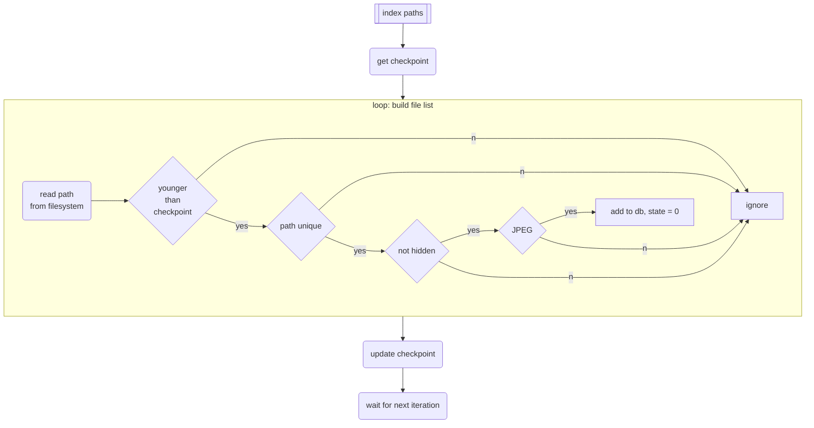
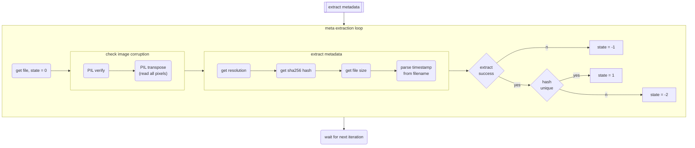
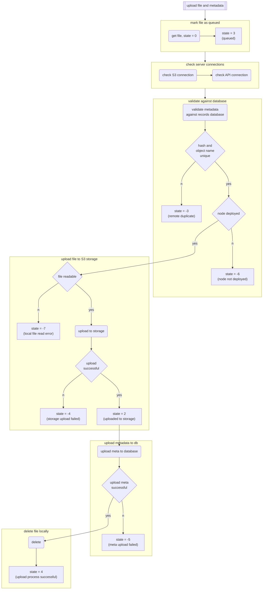

# Mitwelten File Uploader

## Credentials

To run the app or cli, you need to store the PostgreSQL and minIO credentials in a
file `./credentials.py` (see [`credentials_example.py`](../../credentials_example.py)).

## Upload Image Files (manual)

Use the cli [`uploader_cli.py`](./uploader_cli.py) to upload image files recorded by RaspberryPi cameras.

The files are required to follow the format `<node_id>_<utc timestamp>.jpg`.

The cli import and checks the metadata:

- Is the file a valid JPEG image file?
- Are there duplicates (identical content and/or file name) in the files you want to upload?
- Are the files alredy existing in storage/db?

Only files with valid, unique content that don't create file name collisions will be uploaded.

```bash
# example:
pip install -r requirements.txt
python uploader_cli.py --threads 8 /Volumes/SDCARD/
```

This CLI will eventually be updated to also upload other types of media.

## Upload Image Files (on field nodes, automated)

Image Files captures by deployed nodes can be ingested directly from the node by user the `uploader_node` distribution.
The upload process is challenging as it has to account for very low bandwith and limited system resources.
The distribution consists of a python script with configuration and 3 System-D service units.

### Setup

- Clone this repo onto the node
- Install python venv and dependencies
- Install and start the System-D service units

For details check [services/README.md](./services/README.md)

### Running

The system services `img-indexer`, `img-metadata` and `img-uploader` are running in parallel.
The schedule is set by time ranges in `uploader_node_config.py`.
To avoide excessive load / heat on the node, metadata extraction and uploads should run when image caputre is not
running, ideally at night.

The tracking of file states revolves around metadata stored in a local sqlite database (`file_index.db`).
This database contains an index of all files ever processed on a specific node and holds a [state](#filetask-states),
the sha256 hash, image metadata and process timestamps.

#### Index Paths



----

#### Extract Metadata



----

#### Upload File and Metadata



----

### File/Task states

| state | description
| ----- | -----------
|     0 | indexed, new
|       | __error states__
|    -1 | corruption check / meta extraction failed (move)
|    -2 | duplicate hash/object-name locally (delete)
|    -3 | duplicate hash/object-name in database (check if exists in s3 then delete warn and keep)
|    -4 | file upload error
|    -5 | failed to insert metadata in db
|    -6 | node is/was not deployed at requested time
|    -7 | file not found locally
|       | __success states__
|     1 | checked, no local duplicate, file intact
|     2 | upload successful
|     3 | scheduled for upload / upload running
|     4 | deleted locally after successful upload
|     5 | moved corrupted
|    42 | paused

### Maintenance

__Corrupted files__ (state -1) can be moved to a dedicated directory (`/mnt/elements/corrupted/`) for manual inspection.
This command sets `state = 5` once a file is moved.

```bash
python uploader_node.py --move-corrupted
```

Files can fail validation with __duplicate hash in DB__ (state -3) when an upload is retried after previous upload failed or the process was otherwhise interrupted.
These files can be rechecked to make sure they exists in storage, if so they will be deleted locally.
This command sets `state = 4` if the file exists in storage and is deleted locally.

```bash
python uploader_node.py --check-metadupes
```

Files that locally have a __duplicate hash__ (state -2, duplicate content) can be safely deleted.
This state is extremely rare an has no implementation to act on it.

Files that remain in local storage were skipped by the indexing process because the path already existed in the local db.
They can be safely deleted __after a complete index scan__ (the incremental indexing is not 100% safe yet).

## Upload Audio Files

Use the app to upload audiofiles recorded by Audiomoths.
The app imports and checks the metadata from the recorded audio:

- Does the file contain audio (in the correct format)?
- Is the file empty?
- Would there be name collisions in the filename / path with the already existing files?
- Are there files with identical content?

Only audiofiles with valid, unique content that don't create file name collisions will be uploaded.

### HowTo

- Insert SD-Card
- Start the app
- Select the ID printed on the SD-Card from the dropdown menu
- Click "Import Metadata" to select the path to the SD-Card
- _Check if the metadata matches your expectations_
- Click "Upload Audiofiles" to upload the valid files to storage

### Build on macOS / Windows

```bash
pip install -r requirements.txt
pyinstaller mitwelten_uploader_app.spec
```
